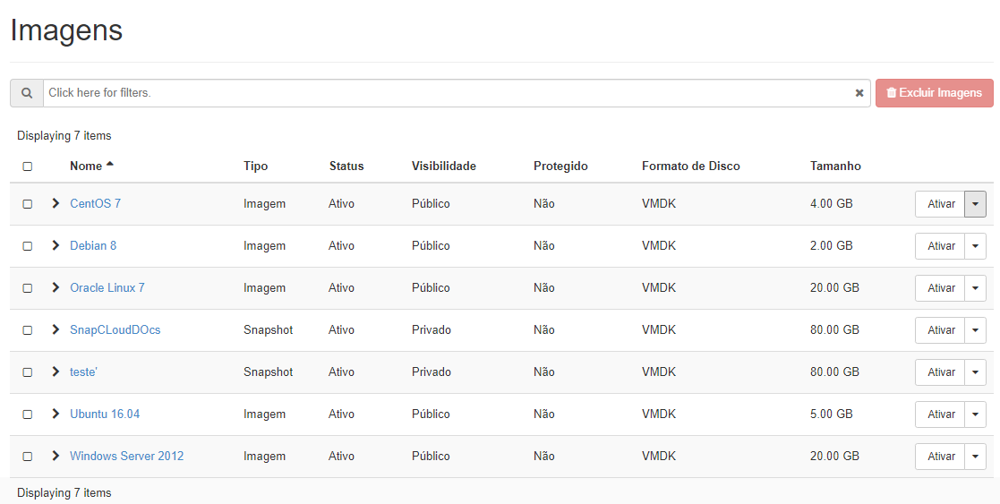

## Imagens

Em **Imagens** você tem os Sistemas Operacionais diponibilizadas para o seu projeto, imagens são a captação do Sistema Operacional que será consumido por uma Instância.

As Instância também podem consumir além de **Imagens** de sistemas operacionais, um Snapshot de uma máquina já criada. Snapshots são a captura dos provisionamentos já criados de uma instância e permitem ao administrador criar uma 'foto instantânea' de um volume lógico em um determinado período. Com esta ferramenta, apenas é salvo o estado do volume no momento que o snapshot foi feito.

Entenda como criar um Snapshot de uma máquina virtual clicando [aqui](../inicial/criar-snapshot.md).

