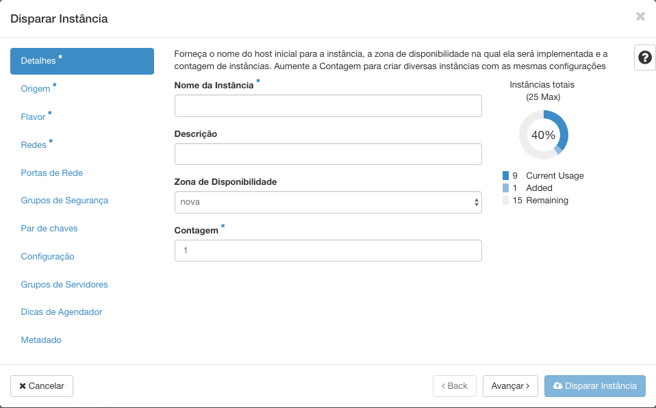
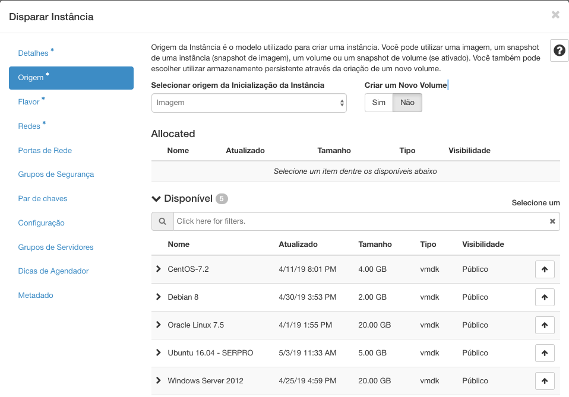
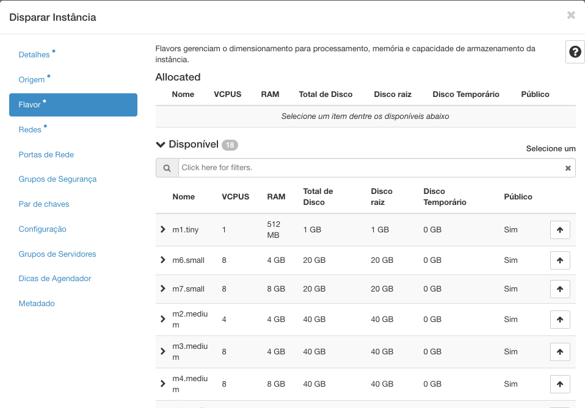
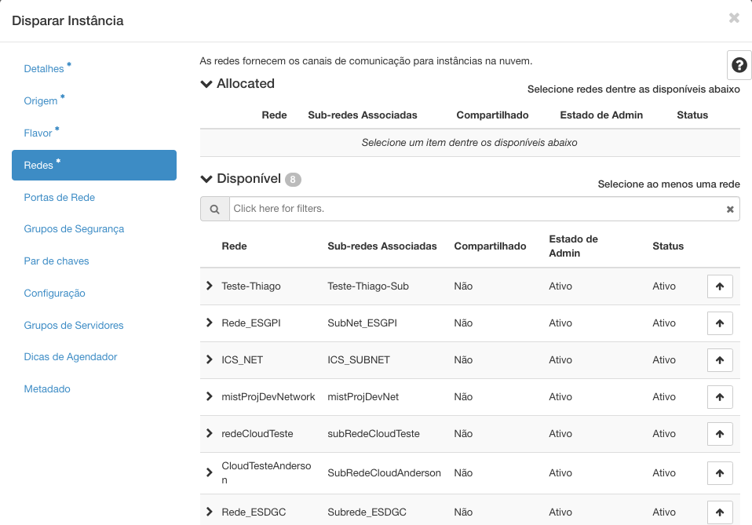
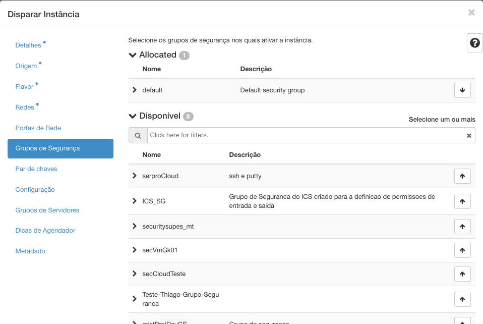
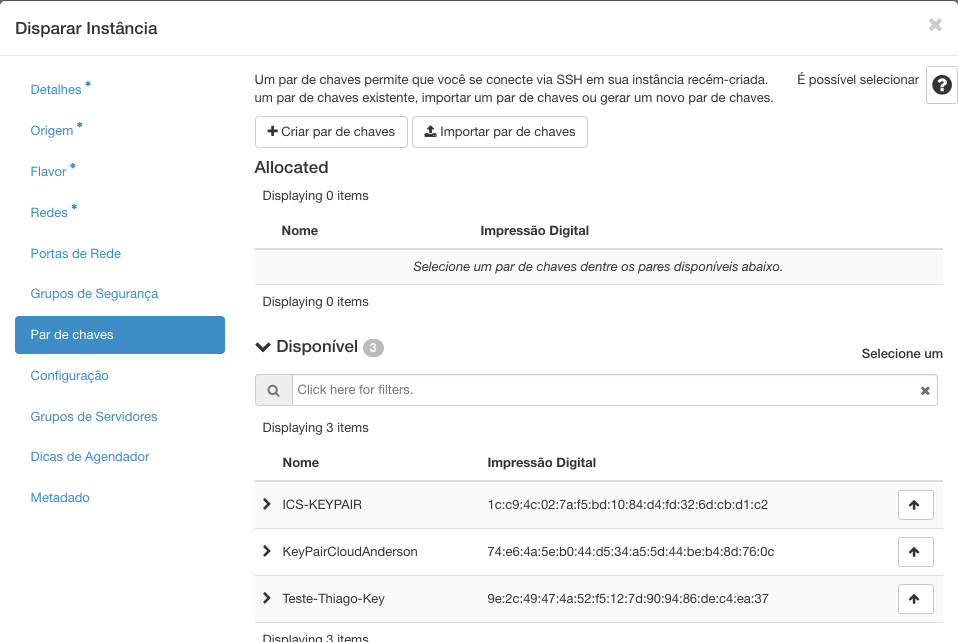

# Instâncias

Para criar uma Instância, tenha certeza que entendeu e cumpriu os passos do Roadmap de Sucesso - Cloud Serpro anteriores:

1. Crie e Configure uma rede;
2. Crie um roteador externo;
3. Crie ou configure grupos de segurança;
4. Dispare uma Instância;
5. Aloque um IP Flutuante;
6. Acesso via SSH.

## Disparando uma Instância

* Em **Computação**, você tem a opção de **Instâncias** onde é permitido o controle, disparo e monitoramento das instâncias associadas ao seu projeto.

* Para o disparo, clique no botão **Disparar Instância**.

* Na aba de **Detalhes** você pode preencher um nome para sua instância, escolher uma zona de disponibilidade e forneces a quantidade de instâncias que deseja criar.

* Já na aba **Origem** você precisa selecionar uma forma de inicializar a instância (a partir de uma **imagem** de um sistema operacional ou **snapshot** de outra instância ou **volume**). 

> Por padrão, devemos selecionar a criação de uma Instância a partir de uma **imagem**.

* Devemos então selecionar na seta para cima uma imagem ou snapshot da lista **Disponível** para alocá-lo à sua instância.

* Nesta aba de **Flavor** temos a possibilidade de escolher uma configuração de hardware que se encaixe no nosso projeto.

> Caso haja um ícone de 'Warning' é um indicativo que aquela configuração excederá os limites alocados para o seu projeto, portanto não há a possibilidade de alocar essa configuração.

* Em **Redes**, podemos escolher a rede a qual a instância ficará conectada. Se não houver redes em seu projeto, é preciso antes criar uma.

> Tome bastante cuidado nesse passo, pois já há a possibilidade de disparar a instância, mas se disparar sem um par de chaves, você não irá conseguir acessá-la remotamente.

* Por padrão todo tráfego externo das instâncias é bloqueado. Por isso, lembre-se de criar regras no seu **Grupo de Segurança** que devem ser previamente provisionados. Na aba do **Grupo de Segurança** escolha o grupo que têm as regras configuradas para seu projeto.

* Na aba **Par de Chaves**, você precisará criar uma nova chave de segurança para o seu projeto ou alocar uma já existente. Lembre-se de salvar em um local seguro o _hash_ da sua **chave privada**, ele será necessário para fazer o acesso remoto via ssh.

Por fim, clique no botão *Disparar Instância* no canto inferior direito e aguarde alguns instantes até que a sua instância seja criada! As instâncias criadas precisam de um IP Público para liberar o acesso externo dela, **Aloque um Ip Flutuante.**

