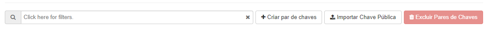

## Pares de Chaves

Pares de chave são credenciais SSH injetadas nas imagens quando instanciadas, não tendo a possibilidade de mudança da chave associada à uma instância, se já injetada ou disparada não há como mudar.

Mas antes de dispararmos uma instância podemos criar nossa chave acessando o painel do Horizon e indo até o menu **Pares de Chaves**. Aqui podemos **Criar Par de Chaves**, **Importar uma chave pública** e **Excluir Pares de Chave**.

::: danger
Proteja e utilize a chave como você faria normalmente com qualquer chave privada SSH.
:::
