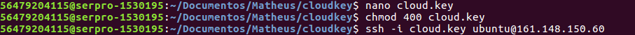
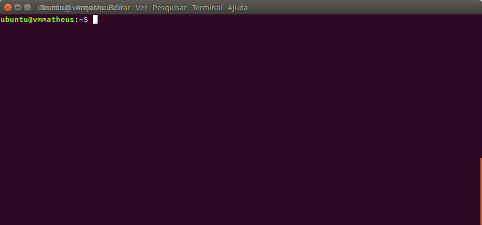

# Acesso Remoto via SSH

O Acesso via SSH é o último passo do Guia Inicial e para que ele ocorra com sucesso, tenha certeza que realizou os passos anteriores.

1. [Crie e Configure uma rede](../redes/redes.md);
2. [Crie um roteador externo](../redes/roteadores.md);
3. [Crie ou configure grupos de segurança](../redes/gruposDeSeguranca.md);
4. [Dispare uma Instância](../computacao/instancias.md);
5. [Aloque um IP Flutuante](../redes/ipsFlutuantes.md);
6. Acesso via SSH;

Também necessário lembrar que o acesso remoto necessita de:

* Ter a porta 22 liberada no grupo de segurança;
* Chave Privada para acesso;
* IP Flutuante (ou externo) associado à instância.

Após garantir que esse passos estão realizados, nada o impedirá de acessar remotamente a sua instância.

## No Linux 

Com o Linux o acesso é facilitado pelo Terminal. Caso você já tenha a Chave Privada salva em seu computador ignore o próximo passo, caso ainda precise salvá-la. 

* Crie um arquivo no terminal e cole o *hash* da sua Chave Privada. Exemplo:

```
nano cloud.key
```

* Para salvar, dê um "CTRL + X" e confirme o nome do arquivo antes de salvar.

* Altere a permissão da chave para 600, através do comando a seguir.

```
chmod 600 cloud.key
```

* Agora basta dar o comando ssh, lembre-se que o username será o nome da distribuição utilizada. Exemplo: Debian9, o usuário é debian; Ubuntu16.04, o usuário é ubuntu.

```
ssh -i cloud.key <username>@<ip_flutuante>
```

Acompanhe nas imagens a seguir, caso tenha dúvida.



