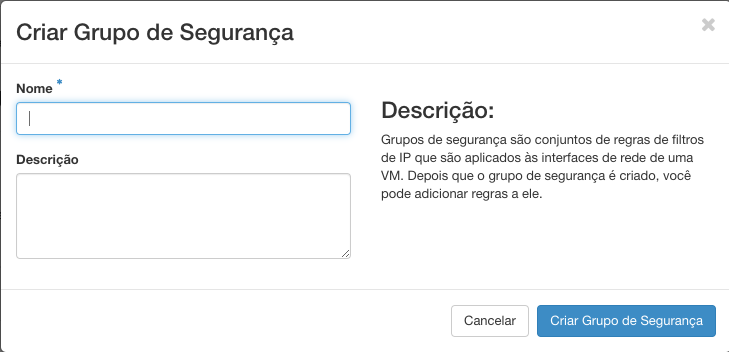

# Grupos de Segurança

Por padrão, todas as conexões de entrada e saída das suas instâncias estarão bloqueadas. Para que elas acessem ou sejam acessadas por uma rede externa, precisamos criar ou configurar o grupos de segurança do nosso projeto.

1. Crie e Configure uma rede;
2. Crie um roteador externo;
3. Crie ou configure grupos de segurança;
4. Dispare uma Instância;
5. Aloque um IP Flutuante;
6. Acesso via SSH.

## Criando um Grupo de Segurança

* Em **Redes**, você tem a opção de criar ou configurar uma coleção de filtros de IP que funcionam como regras de firewall, clicando em **Grupos de Segurança**.

* Para a criação de um roteador basta clicar no botão **Criar Grupo de Segurança**.

* Preencha o **Nome** que será atribuído ao grupo.

* Teremos também a opção de especificar uma **Descrição** base para as regras de segurança daquele grupo.

Por fim basta apenas clicar em **Criar Grupo de Segurança** para finalizar o processo. As regras do grupo devem ser adicionadas configurando o mesmo.

## Configurando um Grupo de Segurança

* Ao lado direito do grupo de segurança desejado haverá um botão de **Administrar Regras** esse botão que irá nos permitir adicionar as regras de acesso.

> É uma boa prática escolher o grupo default apenas para as regras compartilhadas por TODAS as suas instâncias. Se não, recomenda-se escolher ou criar outros grupos.

* Para adicionar regras ao grupo de segurança desejado, basta agora clicar em **Adicionar Regra** e definir as regras necessárias para aquele grupo. Por fim, para finalizar o processo deve-se clicar em **Adicionar** para concluir o processo.

> Lembre-se que para realizar o acesso remoto ao seu projeto, a **regra de SSH deve estar adicionada**. Essa que irá abrir para nós a porta 22.

Seu Grupo de Segurança agora está totalmente usual, o próximo passo do Roadmap de Sucesso da Cloud Serpro é o **Disparo de Instância**.
