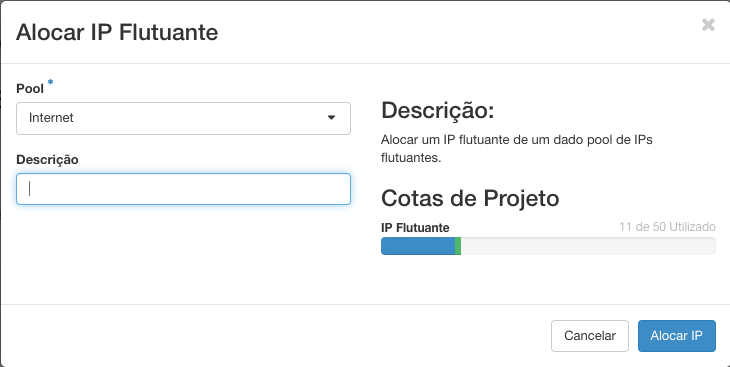

# IPs Flutuantes

Toda Instância associada a uma rede recebe um IP Fixo vindo de sua própria rede, que prove a comunicação com instâncias na mesma rede. Para que ela acesse ou seja acessada por outras redes ou a internet, é importante que ela tenha um IP Flutuante. Para a associação de IP Flutuante, tenha certeza que você cumpriu os passos anteriores.

## Alocando IP Flutuante

* Em **Redes**, você tem a opção de alocar ou associar um IP Flutuante, clicando em **IP Flutuantes**.

* Para a criar um IP Flutuante e alocar o mesmo, basta criar em **Alocar IP para Projeto**.

* Para Alocar, basta selecionar o **Pool de Alocação**, que por definição será a Internet.

* Temos também a opção de especificar uma **Descrição** para aquele IP que será alocado.

* Por fim, basta clicar em **Alocar IP**

## Associar IP Flutuante a uma Instância

* Ao lado direito do IP Flutuante desejado haverá um botão de **Associar** esse botão que irá nos permitir associar a porta (ip fixo) de uma instância.

* Selecione o **Endereço de IP**.

* A **Porta a ser Associada** é ligada ao IP Fixo da Instância desejada.

* Por fim, basta clicar em **Associar**.

A qualquer momento, você poderá remover o IP flutuante de uma instância e associá-lo a outra, sem risco de perder o IP. Ele só é trocado se você liberá-lo do projeto.

