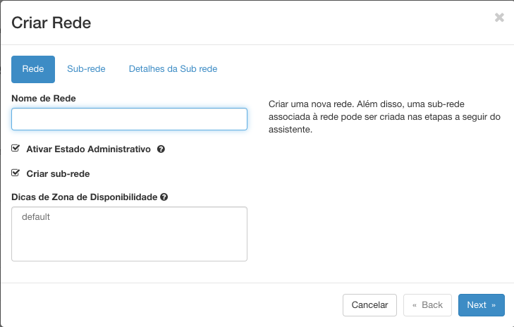
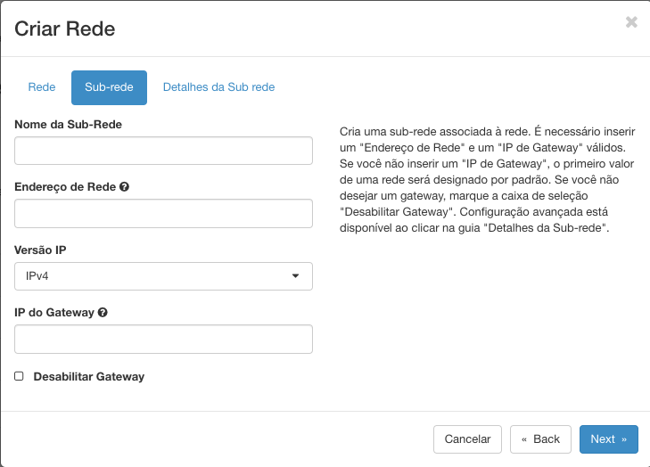
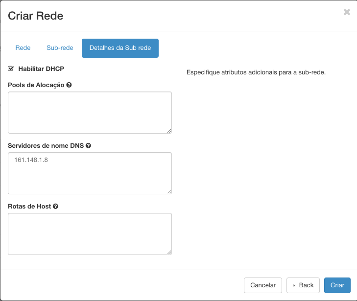

# Redes

A criação de rede é a primeira parte do Roadmap de Sucesso - Cloud Serpro:

1. Crie e Configure uma rede;
2. [Crie um roteador externo](../redes/roteadores.md);
3. [Crie ou configure grupos de segurança](../redes/gruposDeSeguranca.md);
4. [Dispare uma Instância](../computacao/instancias.md);
5. [Aloque um IP Flutuante](../redes/ipsFlutuantes.md);
6. [Acesso via SSH](../inicial/acesso-via-ssh.md);

## Criando sua Rede

* Em **Redes**, você tem a opção de criar ou configurar uma rede, clicando em **Redes**.

* Para a criação de uma rede basta clicar no botão **Criar Rede**.

* Na aba **Rede** temos a possibilidade de atribuir um nome para a Rede que será criada, além disso devemos também selecionar a opção de **Criar uma Sub-Rede** para permitir que os administradores dividam a sua rede privada em segmentos virtuais e que será criada na etapa a seguir.

* Depois de definir o nome e selecionar a opção **Criar Sub-Rede**, clique em **Próximo**.

* Aqui na aba de **Sub-Rede** podemos atribuir um **Nome** para nossa sub, um **Endereço de Rede** que deve ser gerado no formato CIDR. **Versão do IP** que no momento deve ser atribuido IPv4 e o **IP de Gateway**. 

* Depois de Validar as informações clique em **Próximo**.

* Na aba **Detalhes da Sub-Rede** nenhum campo é obrigatório, mas devemos habilitar o DHCP para que as instâncias recebam automaticamente um endereço de IP. No **Pools de Alocação** podemos definir um intervalo de IP's para serem utilizados pelo DHCP (Esse intervalo deve estar dentro da máscara de rede escolhida na aba **Rede**). O **Servidor de Nome DNS** é a lista de endereços de IP de servidores DNS para essa Sub-Rede. **Rotas de Host** são as rotas adicionais para os hosts.

Depois de preencher os campos obrigatórios e os opcionais que desejar, basta clicar no botão Criar e aguardar. A rede criada irá aparecer no painel na opção **Redes**.

