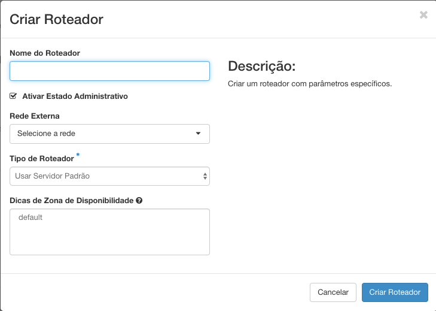

# Roteadores

Para que as redes possam se comunicar, é necessário criar um roteador e conectá-lo a rede do seu projeto. Roteador é o segundo passo do Roadmap de Sucesso da Cloud Serpro: 

1. Crie e Configure uma rede;
2. Crie um roteador externo;
3. Crie ou configure grupos de segurança;
4. Dispare uma Instância;
5. Aloque um IP Flutuante;
6. Acesso via SSH.

## Criando um Roteador

* Em **Redes**, você tem a opção de criar ou configurar um Roteador, clicando em **Roteadores**.

* Para a criação de um roteador basta clicar no botão **Criar Roteador**.

* Preencha os dados solicitados como nome do Roteador, ative a opção Ativar Estado Administrativo e selecione a **Rede Externa** a qual seu roteador estará ligado.

Agora basta clicar no botão **Criar Roteador** e aguardar. O roteador só está conectado a rede externa, devemos **ligá-lo a nossa rede** ou se necessário **Crie e Configure uma rede**.

