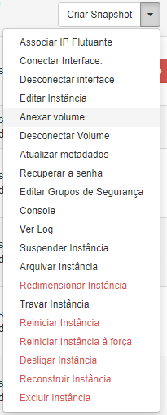

# Anexar Volumes

Para Anexar tenha certeza que você tem um volume criado, se não, aqui te ensinamos a [criar um volume](./criar-volume).

* No Painel do Horizon, clique e **Computação** e na opção **Instâncias** e procure a instância que usaremos para anexar o volume.

* Clicando na seta para baixo teremos várias opções para o gerenciamento da nossa Instância, precisamos clicar em **Anexar Volume**.

::: warning
Não há um limite de volumes à serem atrelados em um instância, porém fique atento aos seus recusos disponíveis.
:::

* Precisamos atribuir o volume criando anteriormente à nossa instância selecionando-o e por fim ao clicar em **Anexar Volume** concluiremos o processo. 

