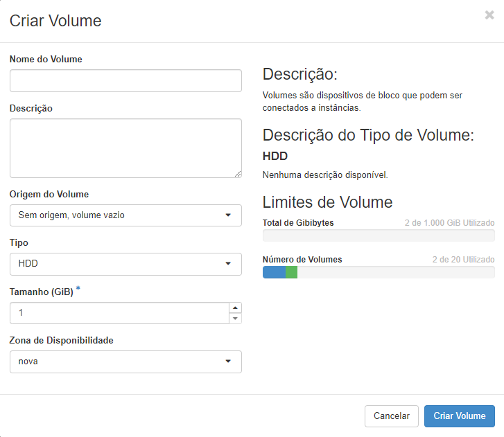

# Criar Volume

Um volume é um dispositivo de armazenamento de bloco destacável, semelhante a um disco rígido USB. Você pode anexar um volume a uma instância em execução ou desanexar um volume e anexá-lo em outra instância a qualquer momento.

* No menu do lado esquerdo, clique em **Volumes** e vá na opção de **Volumes** para que possamos **Criar Volume**.

* Nessa tela serão exibidas algumas informações importantes, como Nome do Volume, Descrição e Tamanho.

* Deve-se especificar um **Nome** para o volume, uma **Descrição** que informe sobre o volume e deve-se selecionar uma das opções de **Origem do Volume**.

> **Sem origem, volume vazio:** Cria um volume vazio que não contém um sistema de arquivos.

>**Imagem:** Você pode selecionar uma imagem que é listada na opção “Imagens” do painel.
>* Tipo: Mostrará os tipos de volumes que podem ser criados.
>* Tamanho do Volume: Especifica qual o tamanho do Volume. Lembrando que deve se atentar a quantidade contratada, porém o painel mostra caso esteja excedendo o espaço

::: warning
Após criar um volume e definir seu tamanho não é possível diminuir seu tamanho futuramente. Caso seja necessário a redução de disco, o mesmo deverá ser excluído para que desta forma libere o tamanho utilizado.
:::

* A **Zona de Disponibilidade** é aonde o volume será criado.

Após preencher os campos solicitados, basta clicar na opção Criar Volume.